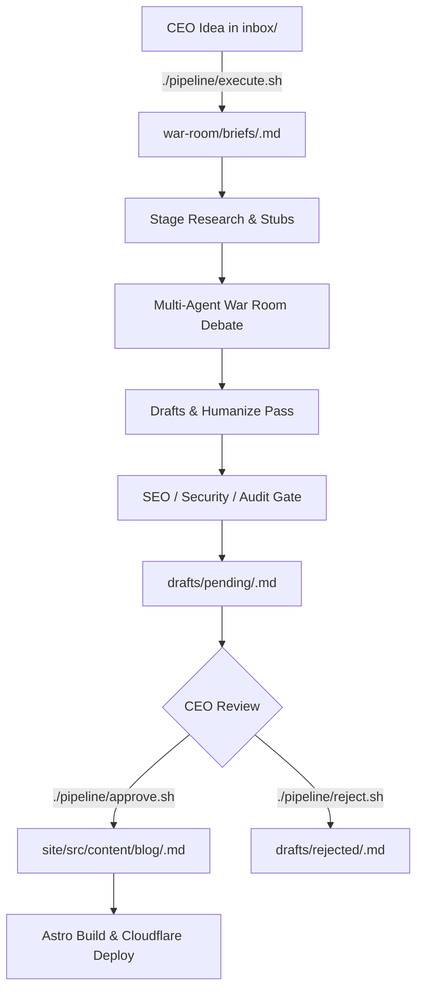

# Mjidea (mji) — Master Project Handover & Complete System Documentation

**Canonical Project Location:** this repository root (portable; historically under `mjI/Mjidea` on Passport)  
**Target Environment:** Portable External Storage (Western Digital "My Passport")  
**Hosting Target:** Cloudflare Pages (`https://mjidea.pages.dev`)  
**Document Version:** 2.1 (Full System Handover)  
**Last Updated:** August 23, 2026  
**Latest snapshot report:** `reports/ceo/2026-08-23-full-handover.md` ← **read this first for current gaps**

---

## 1. Project Overview & Core Philosophy

**Mjidea** is not a single chatbot or a generic blog generator. It is a **standing digital company and philosophical publishing house** designed to operate autonomously on a portable drive.

### The Problem It Solves
Modern digital media is saturated with algorithm-chasing, shallow AI summaries and repetitive thought leadership. Mjidea stands as an antidote: a structured repository of **500+ high-density essays on real human friction**, psychological defaults, and actionable behavioral reframes.

### The Operating Dynamic
1. **CEO (Mj)** floats raw, intuitive thoughts or real-world friction notes into `inbox/`.
2. **Project Manager (Mira Vance) & War Room Director (Kai Ortega)** open a brief and summon a standing council of **25–35 specialized expert agents**.
3. **The War Room** pressure-tests, debates, researches, drafts, humanizes, optimizes for discoverability, and audits the essay.
4. **The CEO Approval Gate** is strictly preserved: drafts sit in `drafts/pending/` until Mj runs `./pipeline/approve.sh <slug>` or provides explicit approval.
5. **Approved essays** are compiled into an ultra-fast, zero-runtime-overhead **Astro static website** deployed at the edge via **Cloudflare Pages**.

---

## 2. Directory Structure & File Taxonomy

```
Mjidea/
├── .cursor/
│   └── rules/
│       └── mjidea-autorun.mdc      # Auto-run rule (forbids permission ping-pong)
├── AGENTS.md                       # Agent system entrypoint & operational charter
├── HOSTING.md                      # Cloudflare Pages deployment & privacy specs
├── ORG.md                          # Organizational chart and authority matrix
├── START.md                        # Quickstart instructions for new sessions
├── HANDOVER.md                     # This complete master handover blueprint
├── audit_report.md                 # Cross-disciplinary 10-expert audit report
├── walkthrough.md                  # Change log and tactical execution log
│
├── brand/
│   └── VOICE.md                    # Voice guidelines, banned AI words, CEO calibration
│
├── inbox/                          # Raw CEO idea intake
│   ├── _TEMPLATE.md                # Standard idea float template
│   ├── HARVEST-MERGE.md            # Harvest merge log of unique ideas
│   ├── IMPORT-LOG.md               # Source traceability index
│   ├── archive/                    # Archived duplicate/merged idea notes
│   ├── harvested/                  # Raw notes extracted from previous projects
│   └── [YYYY-MM-DD-slug].md        # Active CEO idea seed files (17+ ready floats)
│
├── drafts/                         # Draft lifecycle state machine
│   ├── pending/                    # War-room finalized drafts awaiting CEO approval
│   ├── approved/                   # Historical approved drafts
│   └── rejected/                   # Rejected or superseded drafts
│
├── war-room/                       # Active operational war-room artifacts
│   ├── briefs/                     # Structured brief per idea (<slug>.md)
│   ├── output/                     # Departmental output (<slug>.draft|seo|growth|security|audit.md)
│   └── roles/                      # Persona prompt overrides
│
├── reports/                        # Mirrored permanent audit reports
│   ├── research/                   # Web research & citation dossiers
│   ├── seo/                        # Technical SEO & SERP packs
│   ├── growth/                     # Distribution & hook packages
│   ├── security/                   # Threat model & CSP audits
│   ├── audit/                      # Quality & voice gate checkoffs
│   ├── ceo/                        # CEO one-page executive summaries
│   └── war-room/                   # Full war-room debate logs
│
├── published/                      # Permanent timestamped archive of all published blog posts
│
├── team/                           # Standing digital employee organization
│   ├── ROSTER.md                   # Complete list of all 50+ digital employees & IDs
│   ├── STATUS.md                   # Active status board & queue
│   ├── IDEA-BANK.md                # Curated 24-idea priority index
│   ├── TOPIC-ROUTING.md            # Squad assignments by domain category
│   ├── CABINET-SUTHERLAND.md       # Behavioral economics reference patterns
│   └── war-rooms/                  # Department playbooks (01-genius to 09-research, PROTOCOL.md)
│
├── topics/
│   └── topics-500.json             # Master dataset of 500+ human problem/solution topics
│
├── pipeline/                       # Automation bash & node toolchain
│   ├── lib/
│   │   └── common.sh               # Shared helper functions, slugifiers, routing logic
│   ├── ceo-idea.sh                 # Converts raw idea into a brief
│   ├── execute.sh                  # Runs intake, research, and expert squad staging
│   ├── complete-pending.sh         # Runs war room for all pending inbox ideas
│   ├── approve.sh                  # CEO approval script (promotes pending -> published blog)
│   ├── reject.sh                   # Rejection script (moves pending -> rejected)
│   ├── publish-draft.sh            # Copies markdown to Astro content and checks frontmatter
│   ├── run-full-cycle.sh           # Legacy war-room full-cycle initiator
│   └── generate-library.js         # Topic factory script generating Astro markdown from JSON
│
├── social/                         # Phase 2 distribution assets
│   ├── hooks/                      # Short-form video hooks & platform adaptations
│   └── scripts/                    # 60-second spoken video script stubs
│
└── site/                           # Astro 5 Static Website
    ├── astro.config.mjs            # Astro configuration with @astrojs/sitemap
    ├── package.json                # Dependencies (Astro ^7.2.4 / @astrojs/sitemap ^3.7.3)
    ├── tsconfig.json               # TypeScript configuration
    ├── public/
    │   ├── _headers                # Cloudflare Edge Security Headers (CSP, X-Frame-Options)
    │   ├── favicon.svg             # Vector brand mark
    │   ├── favicon.ico             # Legacy browser icon
    │   └── robots.txt              # Search engine crawl directives
    └── src/
        ├── content.config.ts       # Astro Content Collections schema (Zod)
        ├── content/
        │   └── blog/               # 507+ published markdown essay files
        ├── layouts/
        │   └── Base.astro          # Root HTML layout, SEO meta tags, skip-links, fonts
        ├── styles/
        │   └── global.css          # Editorial typography, dark color tokens, responsive layout
        ├── data/
        │   └── issues.ts           # Curated issue seeds for the /issues/ view
        ├── components/
        │   └── AddIdea.astro       # Client-side idea builder & markdown downloader
        └── pages/
            ├── index.astro         # Homepage hero & portal navigation
            ├── about.astro         # Mission statement & company background
            ├── ideas/
            │   ├── index.astro     # Searchable library across all 500+ essays with category pills
            │   └── [slug].astro    # Dynamic essay view with markdown rendering
            └── issues/
                ├── index.astro     # Issues hub
                ├── current.astro   # Active ideas ready for expansion
                └── future.astro    # Pipeline backlog
```

---

## 3. Team Roster & Organizational Architecture

Every agent persona in Mjidea is a standing digital employee. When summoned, they speak with domain authority, challenge assumptions, and produce written artifacts.

### 1. Executive Leadership
* **EX-01 | Mj (CEO):** Floats ideas, sets non-negotiables, possesses exclusive authority to approve/publish.
* **EX-02 | Mira Vance (COO / PM):** Tracks scope, queue velocity, status boards, and ship readiness.
* **EX-03 | Kai Ortega (War Room Director):** Moderates multi-agent adversarial debates and drives consensus.
* **EX-04 | Jules Haber (Chief of Staff):** Synthesizes decisions, checklists, and handover summaries.

### 2. Genius Panel (Always ≥5 Summoned per Debate)
* **GP-01 | Rowan Quill (Behavioral Alchemy):** Thinks like Rory Sutherland — irrational leverage, reframing perception before spending money.
* **GP-02 | Selene Park (Leverage & Brevity):** Thinks like Naval Ravikant — high signal-to-noise ratio, compounding advantages.
* **GP-03 | Theo Marsh (Remarkable Framing):** Thinks like Seth Godin — permission-based, remarkable "Purple Cow" positioning.
* **GP-04 | Iris Cole (Antifragility):** Thinks like Nassim Taleb — asymmetry, stress-testing, downside protection.
* **GP-05 | Jonah Reed (Essay Spine):** Thinks like Paul Graham — relentless pursuit of truth on the page.
* **GP-06 | Ava Shore (Craft Persuasion):** Thinks like David Ogilvy — concrete proof beats slogans.
* **GP-07 | Nix Balboa (Contrarian Stress-Test):** Devil’s advocate who must propose a superior alternative.

### 3. Departmental Squads (≥5 Experts Each)
* **Content Division (CN-01…CN-06):** Elena Voss (Editor-in-Chief), Marcus Hale (Philosopher), Priya Nair (Narrative), Sam Ortiz (Clarity), Leah Kim (Metaphor), Drew Fontaine (Fact-Checker).
* **SEO & Discoverability (SE-01…SE-06):** Nora Blake (Technical SEO), Owen Price (Intent Strategist), Gia Romano (SERP Psychology), Hari Singh (Topic Clusters), Celeste Wu (Schema/Structured Data), Max Rivera (Gap Analysis).
* **Growth & Marketing (GR-01…GR-06):** Dana Frost (Distribution Map), Eli Navarro (Hooks), Mila Cho (Community), Ben Torres (Organic/Paid Planner), Quinn Adeyemi (Experiments), Zoe Hart (Outreach).
* **Product & Website Engineering (EN-01…EN-06):** Alex Ruiz (Lead Astro Engineer), Casey Ng (Performance), Robin Vale (Accessibility), Jamie Orth (Pipeline Tooling), Taylor Brooks (CMS Architecture), Morgan Lee (Cloudflare Edge).
* **Design & Brand (DS-01…DS-05):** Sora Mint (Brand Director), Felix Ard (Typography), Uma Patel (Atmosphere), Kit Lang (Motion), Remy Costa (Visual Direction).
* **Security & Trust (SC-01…SC-06):** Vera Knox (Lead Security), Omar Siddiq (Threat Model), Paige Quinn (Privacy/Cookies), Leon Hart (Dependencies), Nina Brooks (CSP/Headers), Chris Vale (Incident Playbooks).
* **Internal Audit & Quality (AU-01…AU-06):** Helena Orth (Lead Auditor), Vic Lang (Process Integrity), Rae Kim (Voice Compliance), Pat Okonkwo (SEO Audit), Sky Mendel (Launch Gate), Jordan Ell (Retrospectives).
* **Social / Video (VD-01…VD-05):** Luna Reyes (Showrunner), Cade Holt (Short-form Hooks), Mei Zhou (Shot Lists), Andre Silva (Platform Native), Holly Finch (Thumbnail Direction).
* **Ops / Pipeline (OP-01…OP-05):** River Cain (Automation Lead), Sage Bloom (Intake Converter), Dale Frost (Librarian), Remy Ash (Status Maintainer), Indigo Pell (Continuous Backlog Runner).

---

## 4. Brand Voice & Style Constraints (`brand/VOICE.md`)

When writing, drafting, or humanizing essays for Mjidea, **strictly adhere to the Voice Charter**:

### Core Attributes
1. **Philosophy with a Pulse:** Clear opinions, short punchy sentences mixed with rhythmic, reflective lines.
2. **Concrete Scenes over Abstract Fog:** Use sensory proof (e.g. *“what you look at on the subway”*, *“the charging cable on the floor”*) rather than abstract concepts.
3. **Dry Wit:** Earned, quiet observation; never forced jokes or internet slang.
4. **Admit Uncertainty:** Precise and honest rather than artificially authoritative.

### Banned AI Clichés (Zero Tolerance)
Never allow the following words or phrases in published essays:
```
delve, tapestry, landscape (metaphorical), robust, seamless, leverage (as verb filler),
utilize, multifaceted, unlock your potential, game-changer, navigate the, realm of,
it's important to note, in conclusion, moreover, testament, beacon, pave the way,
look no further, in today's fast-paced world, certainly!
```

---

## 5. End-to-End Operational Pipeline & Workflows



### Complete Command Reference

#### 1. Ingest & Float a Single Idea
```bash
cd "$(git rev-parse --show-toplevel 2>/dev/null || pwd)"  # Mjidea repo root

# Create from template
cp inbox/_TEMPLATE.md inbox/my-new-idea.md
# (Edit inbox/my-new-idea.md)

# Run intake & war-room staging
./pipeline/execute.sh inbox/my-new-idea.md
```

#### 2. Run War Room for All Pending Inbox Items
```bash
./pipeline/complete-pending.sh
```

#### 3. Approve and Publish a Pending Draft
```bash
./pipeline/approve.sh <slug>
# This moves the pending draft to site/src/content/blog/<slug>.md
# and archives a timestamped copy in published/
```

#### 4. Reject a Pending Draft
```bash
./pipeline/reject.sh <slug>
```

#### 5. Local Website Preview & Build
```bash
cd site
ASTRO_TELEMETRY_DISABLED=1 npm run build
ASTRO_TELEMETRY_DISABLED=1 npx astro preview --host 0.0.0.0 --port 4321
# Access locally at http://127.0.0.1:4321/
```

#### 6. Deploy to Cloudflare Pages
```bash
cd site
npm run build
npx wrangler pages deploy dist --project-name=mjidea
```

---

## 6. Website Technical Architecture & Schema

### Content Collection Schema (`site/src/content.config.ts`)
```typescript
import { defineCollection, z } from 'astro:content';
import { glob } from 'astro/loaders';

const blog = defineCollection({
  loader: glob({ pattern: '**/*.{md,mdx}', base: './src/content/blog' }),
  schema: z.object({
    title: z.string(),
    description: z.string(),
    pubDate: z.coerce.date(),
    updatedDate: z.coerce.date().optional(),
    tags: z.array(z.string()).default([]),
    category: z.string().optional(),
    draft: z.boolean().default(false),
    thesis: z.string().optional(),
    heroImage: z.string().optional(),
  }),
});

export const collections = { blog };
```

### Categories & Taxonomy (15 Curated Domains)
1. `attention` — Attention & digital life
2. `loneliness` — Loneliness & belonging
3. `mental` — Mental health & pressure
4. `work` — Work & meaning
5. `education` — Education & young minds
6. `trust` — Trust & institutions
7. `climate` — Climate & place
8. `housing` — Housing & cost of living
9. `ai` — Truth, AI & media
10. `health` — Body, food & sleep
11. `democracy` — Polarization & civic life
12. `family` — Family & relationships
13. `inequality` — Fairness & mobility
14. `community` — Local community
15. `future` — Future & agency

---

## 7. Security, Privacy & Edge Configuration

* **Hosting:** Cloudflare Pages (free edge network, HTTP/3, global CDN).
* **Privacy Defaults:** Zero third-party ad tracking, zero persistent profiling cookies. Compatible with Cloudflare Web Analytics or Plausible.
* **Security Headers (`site/public/_headers`):**
  ```txt
  /*
    X-Frame-Options: DENY
    X-Content-Type-Options: nosniff
    Referrer-Policy: strict-origin-when-cross-origin
    X-XSS-Protection: 1; mode=block
    Content-Security-Policy: default-src 'self'; style-src 'self' 'unsafe-inline' https://fonts.googleapis.com; font-src 'self' https://fonts.gstatic.com; script-src 'self' 'unsafe-inline'; img-src 'self' data:; connect-src 'self';
  ```

---

## 8. Strategic Roadmap & Next Actions for Incoming Agents

If starting fresh or picking up development, execute in the following prioritized order:

| Milestone | Task | Component | Impact |
|:---|:---|:---|:---|
| **M1** | **Search Virtualization / In-Memory Index** | `site/src/pages/ideas/index.astro` | Eliminates DOM bloat for 500+ items on mobile |
| **M2** | **Reading HUD & Focus Progress** | `site/src/layouts/Base.astro` | Adds CSS scroll-driven reading bar & read time |
| **M3** | **JSON-LD Schema & RSS Feed** | `site/src/pages/ideas/[slug].astro` & `/rss.xml` | Boosts Google SERP rich snippets & syndication |
| **M4** | **Topical Related Essays Clustering** | `site/src/pages/ideas/[slug].astro` | Increases reader engagement via 2 related links |
| **M5** | **Dynamic OpenGraph Card Generator** | `site/src/pages/og/[slug].png.ts` | Generates 1200x630 social cards for Twitter/iMessage |
| **M6** | **Self-Hosted Typography** | `site/public/fonts/` | Removes Google Fonts DNS lookups for true offline privacy |
| **M7** | **Tier-1 Flagship Deepening** | `site/src/content/blog/` | Enriches top 50 essays with bespoke case studies |

---

## 9. Current gaps (2026-08-23 — update after each milestone)

| Gap | Status | Fix |
|-----|--------|-----|
| Git not initialized | ❌ | `git init -b main` in project root |
| GitHub repo `mjidea` | ❌ | `gh repo create mjidea --public --source=. --push` |
| Cloudflare deploy | ❌ | See `HOSTING.md` + `wrangler pages deploy` |
| Preview `:4321` often down | ⚠️ | Rebuild + `./node_modules/.bin/astro preview --host 127.0.0.1 --port 4321` |
| Pending draft awaiting approve | ⏳ | `drafts/pending/trust-isnt-certified.md` |
| 17 inbox seeds not executed | ⏳ | `./pipeline/execute.sh all-pending` or per slug |

Full troubleshooting + priority list: **`reports/ceo/2026-08-23-full-handover.md`**

---

## 10. Handover Sign-Off

This document encapsulates the institutional memory, technical architecture, team protocols, and file pathways of the **Mjidea** company. For the **latest operational snapshot** (what is done vs not done), read **`reports/ceo/2026-08-23-full-handover.md`** first, then this file for deep reference.

---
*Certified and archived in the project root by Jules Haber (Chief of Staff) and the Mjidea Executive Council.*
