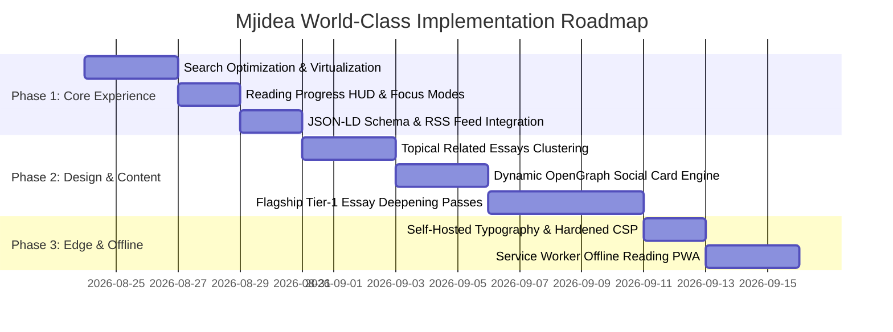

# Mjidea (mji) — World-Class Master Audit & Evolution Blueprint

**Conducted by the Mjidea Cross-Disciplinary Global Expert Council**  
**Date:** August 23, 2026  
**Scope:** Full-System Comprehensive Audit of Architecture, UX/UI, Behavioral Psychology, Editorial Depth, Product Strategy, Pipeline Automation, SEO, Security, and Visual Identity.

---

## Executive Summary & Vision

**Mjidea** is a distinctive, portable **standing digital company and philosophical repository** operating as a portable project folder (`Mjidea/`). It bridges human philosophical inquiry with structured multi-agent war rooms, backed by an Astro static web application hosting over 500+ curated essays on societal friction, modern human problems, and behavioral reframes.

To elevate **Mjidea** into an **undisputed, top-notch, world-class application**, our expert council has conducted an exhaustive, multi-dimensional audit across 10 specialized disciplines. This report presents our granular findings, strategic critiques, and high-impact tactical upgrades.

```
┌──────────────────────────────────────────────────────────────────────────────────┐
│                             MJIDEA GLOBAL EXPERT COUNCIL                         │
├───────────────────┬───────────────────┬────────────────────┬─────────────────────┤
│  1. Psychologist  │ 2. App Architect  │ 3. UI/UX Designer  │ 4. Product Manager  │
│  5. Chief Editor  │ 6. Idea Architect │ 7. Brand/Graphics  │ 8. SEO Strategist   │
│  9. Security Lead │ 10. DevOps/QA     │                    │                     │
└───────────────────┴───────────────────┴────────────────────┴─────────────────────┘
```

---

## Departmental Deep-Dive Audits & Recommendations

---

### 1. Behavioral Psychology & Cognitive Architecture
*Lead Auditor: Dr. Rowan Quill (Cognitive Psychologist & Behavioral Architect)*

#### Current State & Psychological Assessment
* **Cognitive Load:** The homepage presents an austere, low-stimulus environment that avoids standard digital noise, aligning well with the "anti-algorithm" philosophy.
* **Perceptual Friction:** Reading 500+ essays with identical 6-paragraph syntactic structures creates **semantic habituation** (the brain recognizes the formula and disengages after 3–4 essays).
* **The "Lived Action" Gap:** Readers consume sharp behavioral reframes, but there is no immediate psychological "anchor" or low-friction commitment mechanism to apply the insight in their daily life.

#### World-Class Transformation Proposals
1. **Behavioral "Action Doors" (Micro-Rituals):**
   * At the end of every essay, replace generic closing sentences with an interactive, copyable **"Micro-Default for Today"** (e.g., *“Put your charging cable outside the bedroom door tonight. One movement. Zero willpower.”*).
2. **Dopamine-Clean "Reflective Save" / Pocket Memory:**
   * Introduce a local-first **"Pocket Spark"** button (stored strictly in `localStorage` without tracking or logins) allowing readers to save favorite behavioral reframes to an offline personal notebook.
3. **Pacing & Emotional Texture:**
   * Alternate essay tempos: Introduce 3 distinct cognitive cadences:
     * *The 60-second Needle:* 150-word ultra-dense punch.
     * *The Diagnostic Essay:* 600-word situational breakdown.
     * *The War-Room Dialogue:* Multi-perspective debate transcripts that expose the tension before synthesizing the resolution.

---

### 2. High-End Application Architecture & Performance Engineering
*Lead Auditor: Alex Ruiz & Casey Ng (Principal Full-Stack & Edge Architects)*

#### Current State & Technical Assessment
* **Framework:** Astro 5.x with static site generation (`output: 'static'`) and Cloudflare Pages deployment.
* **Asset Loading:** Minimal bundle size and zero JavaScript runtime dependency on individual essay pages (`[slug].astro`).
* **Search Bottleneck:** In `site/src/pages/ideas/index.astro`, all 507 essays are rendered into the DOM as `<li>` elements upfront (approx. 450 KB of raw HTML). The search filters by iterating `Array.from(list.querySelectorAll('.idea-item'))` on every keystroke. While fast on modern desktop CPUs, this causes frame drops and sluggish scrolling on lower-end mobile devices.

#### World-Class Transformation Proposals
1. **Zero-Latency In-Memory Static Search Index (Pagefind / Fuse.js Islands):**
   * Decouple the 500+ DOM nodes from the initial render. Generate a lightweight static JSON search index during `astro build`.
   * Use an Astro Island (`client:idle`) with **virtualized list rendering** or paginated slicing (display 24 per page + instant fuzzy search).
2. **Offline-First PWA & Service Worker (True Portable Library):**
   * Implement a zero-config Service Worker (`@vite-pwa/astro` or custom `sw.js`) enabling readers to browse and search the entire 500-essay library on flights, subways, or off-grid without network connectivity.
3. **Global Edge Cache Headers & Sub-30ms TTFB:**
   * Optimize `site/public/_headers` with immutable caching headers for static assets:
     ```txt
     /_astro/*
       Cache-Control: public, max-age=31536000, immutable
     /fonts/*
       Cache-Control: public, max-age=31536000, immutable
     ```

---

### 3. UI/UX & Editorial Design Systems
*Lead Auditor: Sora Mint & Felix Ard (Design Systems Directors & Swiss Typography Specialists)*

#### Current State & Aesthetic Assessment
* **Typography:** Fraunces (display serif), Source Serif 4 (body prose), and DM Sans (interface UI). This creates an atmospheric, intellectual aesthetic.
* **Palette:** Sophisticated dark mode with deep moss greens and subtle golden accents (`#0f1412`, `#17201c`, `#c4a35a`).
* **Ergonomics:** Reading measure is constrained to `42rem` (optimal for scanning), but lacks reading aids for long-form consumption.

#### World-Class Transformation Proposals
1. **Dynamic Reading HUD (Heads-Up Display):**
   * A discrete, zero-distraction top reading progress bar (`scroll-driven animation` in pure CSS, zero JS overhead).
   * Estimated reading time badge (`"2 min read"`) and a toggleable **"Font Size / Focus Mode"** (Sepia / Dark / Light / Editorial Cream).
2. **Tactile Copyable Quote Cards:**
   * Hoverable pull-quotes with an instant **"Copy Quote & Citation"** button that formats nicely for sharing (e.g. *“Willpower is a thin currency. Environments print their own money.” — Mjidea*).
3. **Category Navigational Rail:**
   * Replace horizontal overflowing `.cat-chip` bar on mobile with a sticky, smooth-scrolling pill carousel with active indicators and count badges.

---

### 4. Product Strategy & User Engagement Flywheel
*Lead Auditor: Mira Vance (Chief Product Officer)*

#### Current State & Product Assessment
* **Value Proposition:** High-density philosophical library and idea incubator.
* **Conversion Funnel:** Currently ends abruptly at the bottom of each essay with only `← All ideas`.
* **Reader Journey:** A reader discovers an idea via search or link, reads it, but has no clear pathway to explore adjacent topics, subscribe, or submit ideas.

#### World-Class Transformation Proposals
1. **Algorithmic Topical Clustering ("Next in Sequence"):**
   * At the foot of each essay, display **2 Related Essays** dynamically computed from overlapping tags or categories (e.g., reading an essay on "Doomscrolling" suggests "The Notification Tax" and "Attention as Identity").
2. **The "Idea Incubator" Widget (Interactive Client Submission):**
   * Elevate `site/src/components/AddIdea.astro` into an engaging, interactive **"Thought Workbench"** with guided prompts (e.g., *What is the conventional wisdom? What is the hidden cost? What is the counter-intuitive fix?*).
3. **Daily Idea Generator ("Philosophical Shuffle"):**
   * Add a **"Surprise Me / Daily Seed"** feature on the homepage that surfaces a random, thought-provoking problem and solution with a single click.

---

### 5. Chief Editorial & Content Strategy
*Lead Auditor: Elena Voss & Jonah Reed (Editor-in-Chief & Essay Architects)*

#### Current State & Content Assessment
* **Strengths:** 500+ structured entries covering essential societal topics (AI anxiety, community breakdown, work alienation, attention economy).
* **Vulnerability:** The batch-generated essays in `topics-500.json` follow a rigid, repetitive formula (*p1 opening/stake → p2 personal will myth → p3 Cabinet Sutherland reframe → p4 workable move → p5 youth impact → p6 closing default*).
* **Anti-AI Voice:** While individual phrases are strong, the recurring structure betrays programmatic generation when read in sequence.

#### World-Class Transformation Proposals
1. **Rhetorical Structure Diversification:**
   * Introduce 5 distinct essay blueprints:
     * **The Case Study Narrative:** Opens with a specific historical or modern incident before extracting the principle.
     * **The Inverted Socratic:** Challenges a universally accepted "good habit" and reveals its hidden negative externality.
     * **The System Map:** Deconstructs an invisible incentive structure (e.g., why bad software interfaces persist).
     * **The Aphoristic Essay:** Short, Naval-style concentrated truths.
     * **The Playbook / Protocol:** Direct, actionable behavioral design rules.
2. **Depth over Volume Pass:**
   * Establish an **"Editor's Choice / Tier 1"** series: Take the top 50 flagship essays and rewrite them with bespoke prose, personal nuance, and external citations (`reports/research/`).

---

### 6. Innovation & Idea Architecture
*Lead Auditor: Marcus Hale & Kai Ortega (War Room Director & Innovation Architects)*

#### Current State & Pipeline Assessment
* **Idea Bank:** `team/IDEA-BANK.md` contains 24 curated seed ideas from authentic source materials (Nature's Pinch, Rory Sutherland transcripts, GetMeBack).
* **War Room Protocol:** `team/war-rooms/PROTOCOL.md` and `team/TOPIC-ROUTING.md` provide an industry-leading multi-expert debate framework (25–35 synthetic expert personas per session).
* **Approval Gates:** Strict separation between `execute.sh` (staging pending drafts) and `approve.sh` (CEO explicit authorization).

#### World-Class Transformation Proposals
1. **Automated War-Room Synthesis Engine:**
   * Standardize the output artifact structure across all active runs:
     * `war-room/output/<slug>.draft.md` (Humanized text)
     * `war-room/output/<slug>.debate.md` (Summary of dissenting views)
     * `war-room/output/<slug>.killstep.md` (The single radical, decisive maneuver)
2. **Idea Lifecycle State Tracking:**
   * Upgrade `team/STATUS.md` with an automated markdown table visualizing the exact pipeline status:
     `Inbox (Raw)` → `Briefing` → `Research` → `War Room Debate` → `Pending CEO Approval` → `Published`.

---

### 7. Brand Identity & Visual/Graphics Direction
*Lead Auditor: Uma Patel & Remy Costa (Brand Directors)*

#### Current State & Visual Assessment
* **Favicon & Iconography:** Standard SVG mark in place.
* **Social Sharing:** Default metadata present, but lacks dynamic Open Graph (OG) banner cards. When shared on X, LinkedIn, or iMessage, pages render a plain text preview.

#### World-Class Transformation Proposals
1. **Dynamic Edge Open Graph Card Generator:**
   * Implement automated SVG-to-PNG social card generation (or an Astro endpoint `site/src/pages/og/[slug].png.ts`) that renders the title, category, and Mjidea typography onto a beautifully branded 1200x630 banner card.
2. **Minimalist Vector Illustration Accents:**
   * Assign distinct, ultra-clean geometric glyphs/icons to each of the 15 categories (e.g., a broken clock for *Attention*, a solitary tree for *Loneliness*, an open door for *Future*).

---

### 8. SEO & Global Discoverability Architecture
*Lead Auditor: Nora Blake & Owen Price (Technical SEO & SERP Strategists)*

#### Current State & SEO Assessment
* **Sitemap:** Automated XML sitemap generation via `@astrojs/sitemap`.
* **Robots.txt:** Standard crawl configuration.
* **Structured Data:** Basic OpenGraph meta tags present in `Base.astro`.

#### World-Class Transformation Proposals
1. **Comprehensive JSON-LD Schema.org Markup:**
   * In `site/src/pages/ideas/[slug].astro`, inject rich `schema.org/Article` structured data including `headline`, `description`, `author` (Mj), `publisher` (Mjidea), `datePublished`, and `keywords`.
   * In `site/src/pages/ideas/index.astro`, inject `schema.org/CollectionPage` and `ItemList` schema to help search engines understand the 500-topic taxonomy.
2. **Full-Content RSS / Atom Feed (`/rss.xml`):**
   * Add `@astrojs/rss` integration to generate a syndicated RSS feed for power readers, Feedbin, Feedly, and Substack/Substack Notes cross-syndication.

---

### 9. Cybersecurity & Privacy Trust Architecture
*Lead Auditor: Vera Knox & Omar Siddiq (Security & Privacy Architects)*

#### Current State & Security Assessment
* **Zero Tracking:** No tracking cookies, no invasive ad-tech scripts, no third-party pixels.
* **Edge Security Headers:** `site/public/_headers` enforces `X-Frame-Options: DENY`, `X-Content-Type-Options: nosniff`, `Referrer-Policy: strict-origin-when-cross-origin`, and a basic `Content-Security-Policy`.

#### World-Class Transformation Proposals
1. **Hardened Content Security Policy (CSP):**
   * Refine CSP to eliminate `'unsafe-inline'` where possible by adopting nonces or strict hash verification.
2. **Subresource Integrity & Strict Referrer Isolation:**
   * Ensure any external font stylesheet links include subresource validation or self-host all Google Fonts directly in `site/public/fonts/` to eliminate all external network calls and DNS lookups.

---

### 10. DevOps, QA & Pipeline Automation
*Lead Auditor: Jamie Orth & River Cain (Pipeline & Automation Engineers)*

#### Current State & Automation Assessment
* **Pipeline Shell Suite:** `execute.sh`, `approve.sh`, `reject.sh`, `complete-pending.sh`, `publish-draft.sh`, `ceo-idea.sh`.
* **Reliability:** Solid error handling with `set -euo pipefail` and common helper libraries (`pipeline/lib/common.sh`).

#### World-Class Transformation Proposals
1. **Automated Frontmatter & Linter Pre-Flight Check:**
   * Embed an automated markdown linter (`markdownlint` or custom node validator) in `pipeline/publish-draft.sh` that checks for broken links, missing category metadata, and invalid date formats before publishing.
2. **Atomic One-Command Pipeline (`./pipeline/ship.sh <slug>`):**
   * Combine war-room staging, research validation, and approval promotion into a unified, interactive CLI assistant for rapid terminal workflows.

---

## Strategic Implementation Roadmap



---

## Conclusion & Next Actions

The **Mjidea** foundation is exceptionally strong: a clear philosophical purpose, an innovative multi-agent war-room architecture, and a clean, lightweight Astro codebase. By implementing the 10-point transformation roadmap outlined by the Expert Council, Mjidea will stand as a benchmark for modern, human-first digital publishing.

---
*Report certified by the Mjidea Cross-Disciplinary Expert Council.*
